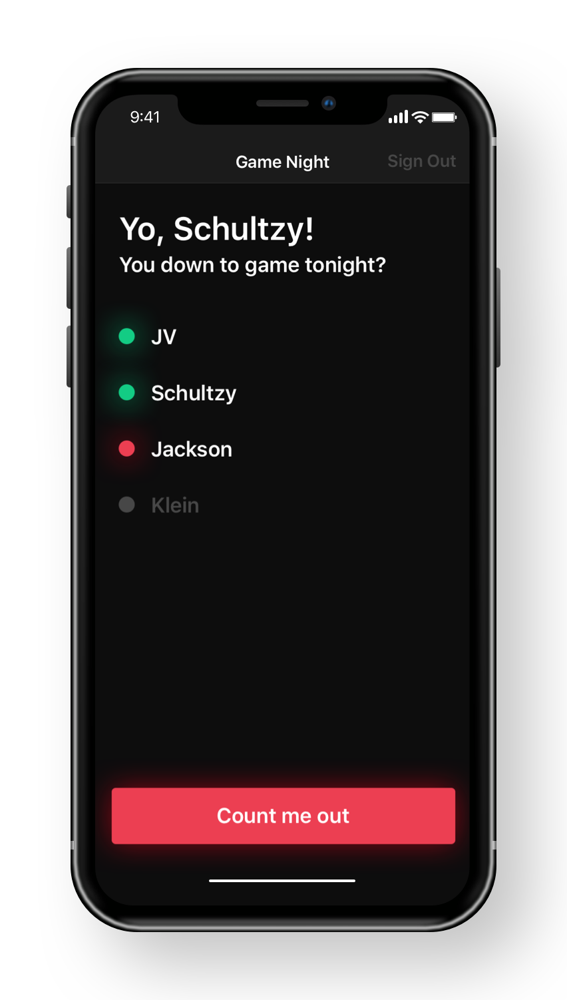

# Gamenight App
## https://github.com/michaelwschultz/gamenight
#### Built by Michael Schultz https://michaelschultz.com
App for letting your friends know you're down to game tonight. Initial idea by @kleinmaetschke.



Gamenight is built with React Native for iOS and Android.

---

#### Running the app locally
This app requires Node https://nodejs.org. Download the latest version before getting started.

##### Database
Data is stored in a Firebase Realtime Database. You can sign up for a free account at https://firebase.google.com/.
Once you've created an account, enter your details into firebase-config-sample.js and save the file as firebase-config.js

##### Expo
This project uses Expo https://expo.io/tools to build and test locally in both the iOS simulator and on devices. I still use the Expo XDE although it looks like they are no longer developing it. You can also use the Expo CLI which is under heavy development.

- Expo XDE https://github.com/expo/xde/releases
- Expo CLI https://expo.io/tools#client

Follow the instructions to run the app depending on which version of the software you decide to use. If you use the CLI just run the start command.

```
$ expo start
```

#### Deploying
Currently I'm lookinig into Fastlane. I haven't used it before but it looks promising. I'll report back.